# Comparaison des schémas numériques en volumes finis

Résultats visuels des schémas Rusanov, HLL, HLLC et Roe sur des cas tests de Riemann pour les équations d'Euler. Chaque GIF montre la performance des schémas sur les discontinuités. Organisation par cas test avec états initiaux en LaTeX (densité (\\rho), vitesse (u), pression (p)) et forces/faiblesses.

Les équations d'Euler en 1D s'écrivent : \[ \\frac{\\partial}{\\partial t} \\begin{pmatrix} \\rho \\ \\rho u \\ E \\end{pmatrix} + \\frac{\\partial}{\\partial x} \\begin{pmatrix} \\rho u \\ \\rho u^2 + p \\ u(E + p) \\end{pmatrix} = 0, \\quad E = \\frac{p}{\\gamma - 1} + \\frac{1}{2} \\rho u^2, \\quad \\gamma = 1.4 \] Discontinuité initiale à (x = 0.5).

## 1. Tube à choc de Sod

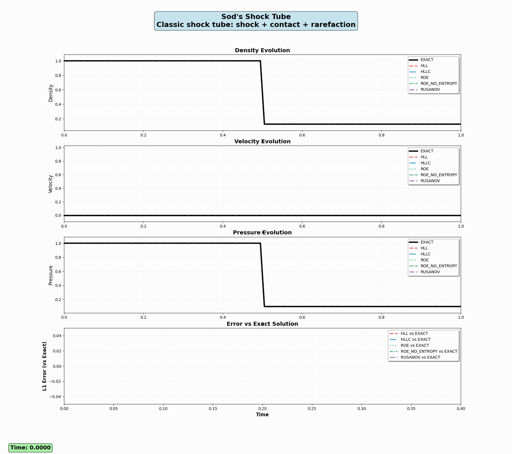
- **Test** : Onde de choc, onde de détente, contact.
- **États initiaux** : \[ \\text{Gauche : } (\\rho_L, u_L, p_L) = (1.0, 0.0, 1.0), \\quad \\text{Droite : } (\\rho_R, u_R, p_R) = (0.125, 0.0, 0.1) \]
- **Rusanov** : Simple, robuste, mais très diffusif, lisse les discontinuités.
- **HLL** : Moins diffusif, capture mieux les chocs, floute les contacts.
- **HLLC** : Précis sur contacts et chocs, bonne résolution.
- **Roe** : Très précis, mais peut violer l'entropie.

## 2. Contact stationnaire

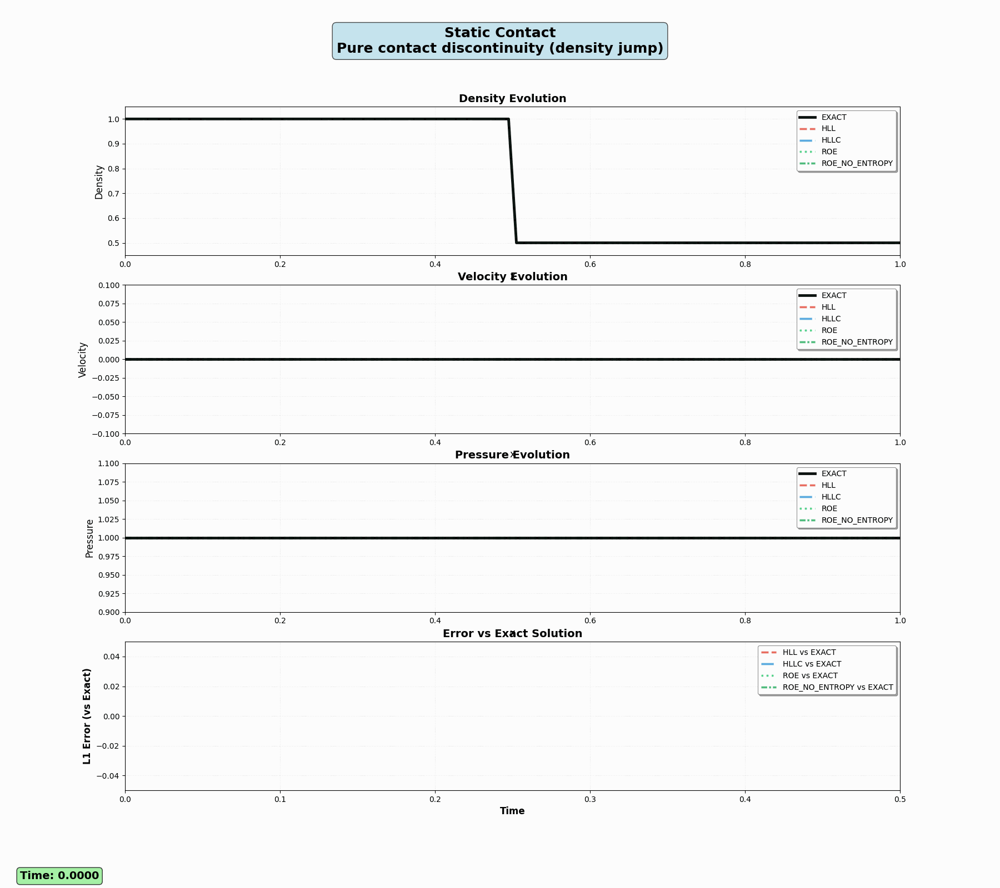
- **Test** : Discontinuité de contact immobile.
- **États initiaux** : \[ \\text{Gauche : } (\\rho_L, u_L, p_L) = (1.0, 0.0, 1.0), \\quad \\text{Droite : } (\\rho_R, u_R, p_R) = (0.5, 0.0, 1.0) \]
- **Rusanov** : Trop diffusif, mauvaise résolution du contact.
- **HLL** : Améliore la résolution, mais toujours flou.
- **HLLC** : Excellent pour les contacts stationnaires, netteté quasi-parfaite.
- **Roe** : Précis, mais oscillations possibles sans correction d'entropie.

## 3. Contact mobile

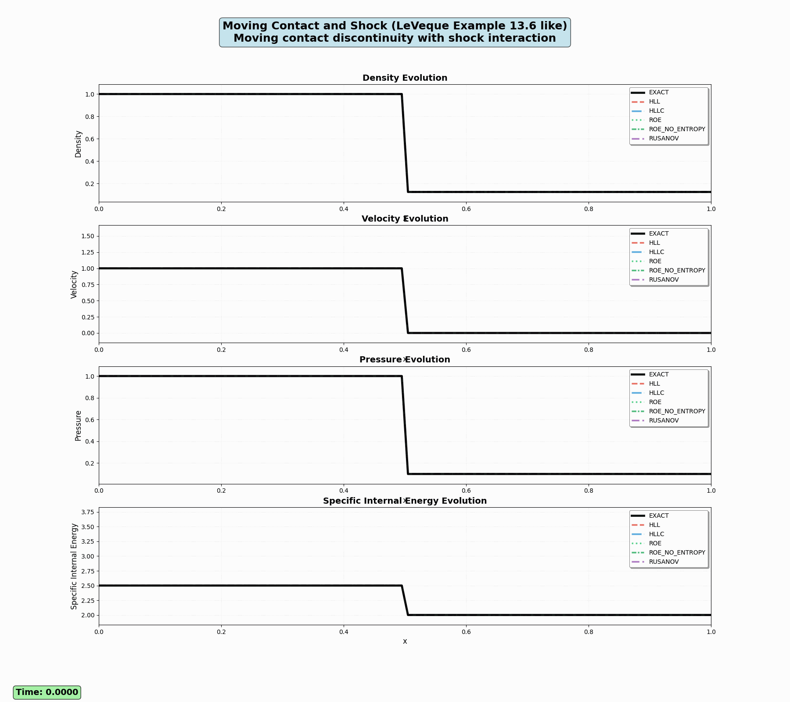
- **Test** : Contact en mouvement avec choc.
- **États initiaux** : \[ \\text{Gauche : } (\\rho_L, u_L, p_L) = (2.0, 1.0, 1.0), \\quad \\text{Droite : } (\\rho_R, u_R, p_R) = (1.0, 1.0, 1.0) \]
- **Rusanov** : Efface les chocs et contacts, perte de détails.
- **HLL** : Mieux sur les chocs, mais contacts flous.
- **HLLC** : Résout bien contacts et chocs, très fiable.
- **Roe** : Précis, mais sensible aux violations d'entropie.

## 4. Tests de Toro

### Toro Test 1

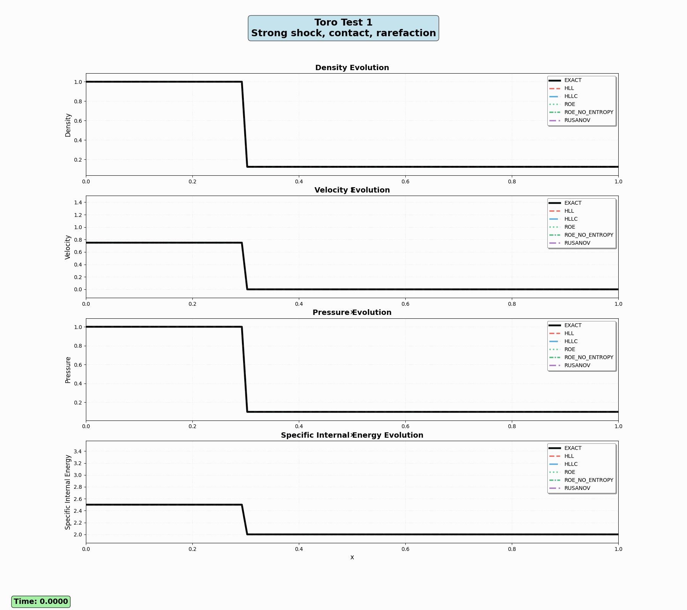
- **États initiaux** : \[ \\text{Gauche : } (\\rho_L, u_L, p_L) = (1.0, 0.75, 1.0), \\quad \\text{Droite : } (\\rho_R, u_R, p_R) = (0.125, 0.0, 0.1) \]
- **Test** : Choc fort, contact, rarefaction.

### Toro Test 2

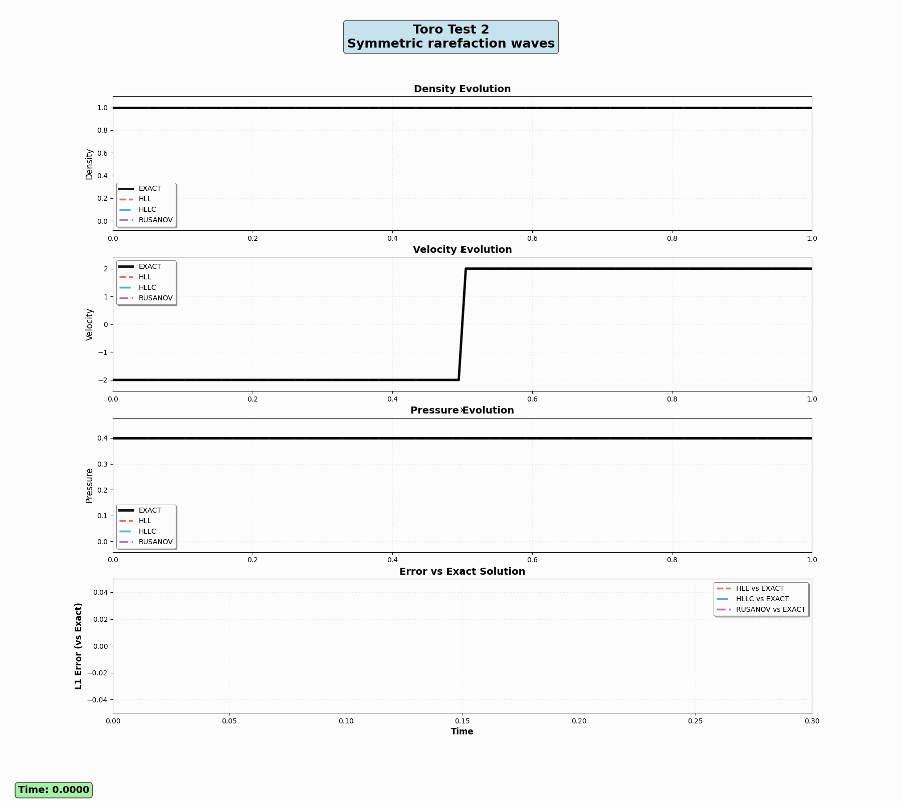
- **États initiaux** : \[ \\text{Gauche : } (\\rho_L, u_L, p_L) = (1.0, -2.0, 0.4), \\quad \\text{Droite : } (\\rho_R, u_R, p_R) = (1.0, 2.0, 0.4) \]
- **Test** : Ondes de détente symétriques.

### Toro Test 3

- **États initiaux** : \[ \\text{Gauche : } (\\rho_L, u_L, p_L) = (1.0, 0.0, 1000.0), \\quad \\text{Droite : } (\\rho_R, u_R, p_R) = (1.0, 0.0, 0.01) \]
- **Test** : Rarefaction forte.
- **Rusanov** : Stable mais floute tout, perte de précision.
- **HLL** : Meilleure capture des chocs, contacts faibles.
- **HLLC** : Équilibre précision/stabilité, bon sur tous les cas.
- **Roe** : Très précis, mais instable sans correction d'entropie.

## 5. Formation de vide

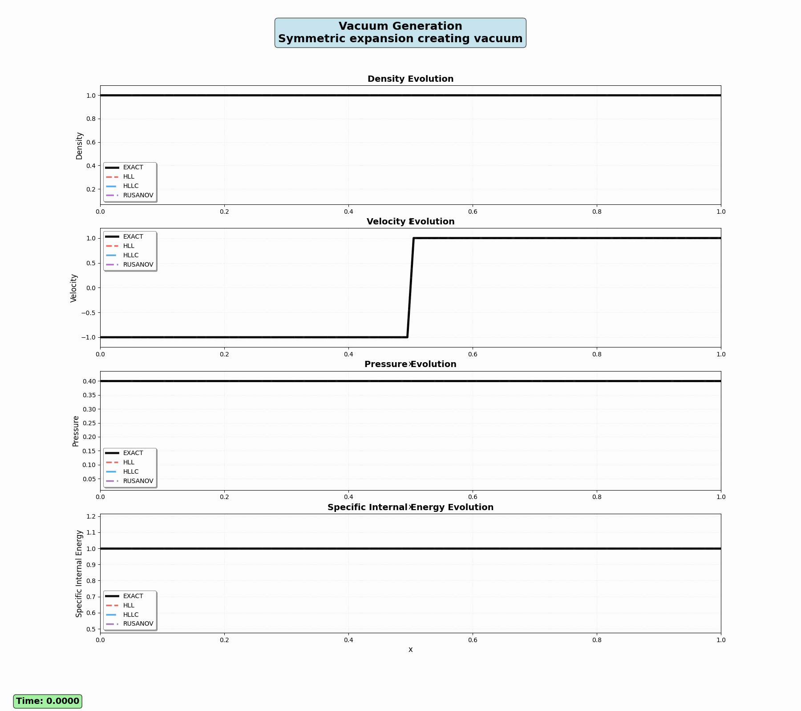

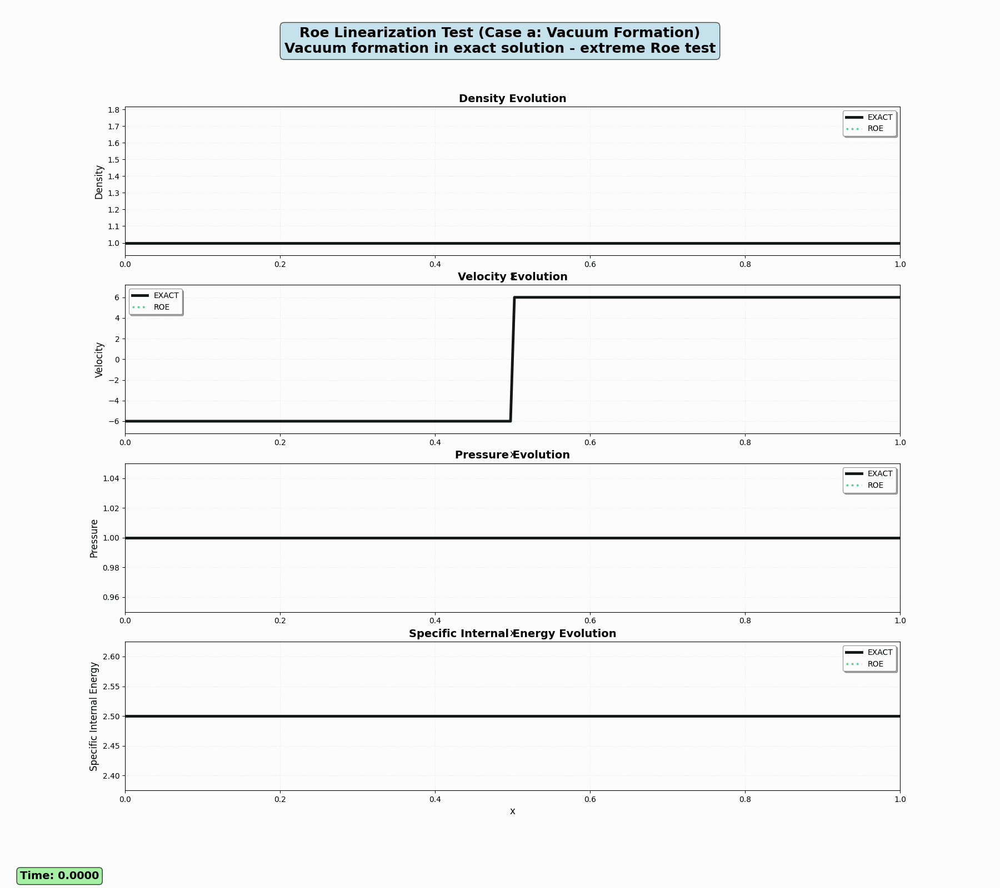
- **Test** : Régime de vide (rarefaction extrême).
- **États initiaux** : \[ \\text{Gauche : } (\\rho_L, u_L, p_L) = (1.0, -1.0, 0.4), \\quad \\text{Droite : } (\\rho_R, u_R, p_R) = (1.0, 1.0, 0.4) \]
- **Rusanov** : Robuste, mais mauvaise résolution des fronts.
- **HLL** : Gère bien les rarefactions, mais moins précis.
- **HLLC** : Bonne résolution, capture bien le vide.
- **Roe** : Très précis, mais peut diverger sans linéarisation adaptée.

## 6. Roe linéarisable vs non-linéarisable

### Roe linéarisable

- **États initiaux** : \[ \\text{Gauche : } (\\rho_L, u_L, p_L) = (1.0, -0.5, 1.0), \\quad \\text{Droite : } (\\rho_R, u_R, p_R) = (1.0, 0.5, 1.0) \]
- **Test** : Linéarisation Roe valide, test de correction d'entropie.

### Roe non-linéarisable

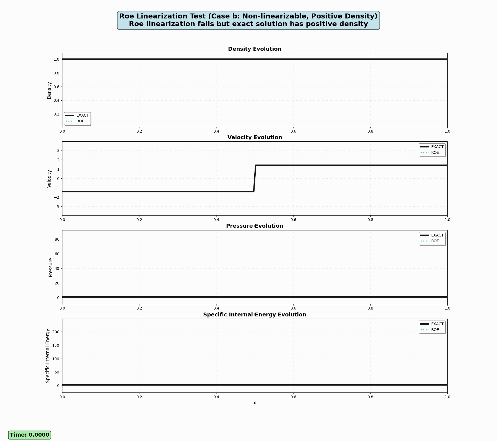
- **États initiaux** : \[ \\text{Gauche : } (\\rho_L, u_L, p_L) = (1.0, -\\sqrt{2}, 1.0), \\quad \\text{Droite : } (\\rho_R, u_R, p_R) = (1.0, \\sqrt{2}, 1.0) \]
- **Test** : Linéarisation Roe échoue, densité positive.
- **Roe** : Excellent sur cas linéarisables, mais échoue sans correction.

## 7. Onde de choc et rarefaction forte

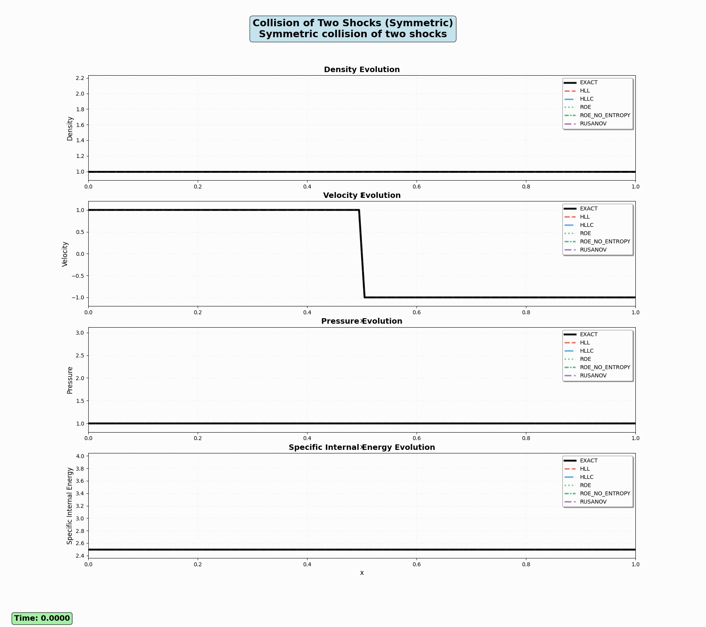

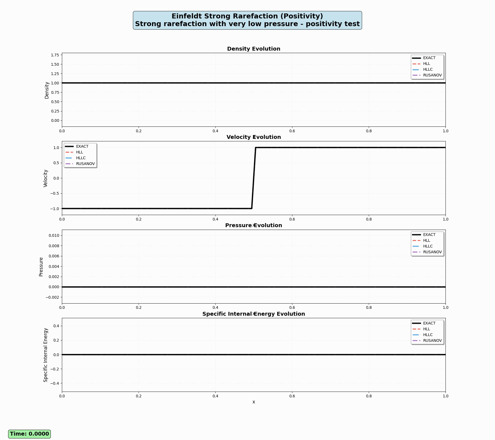

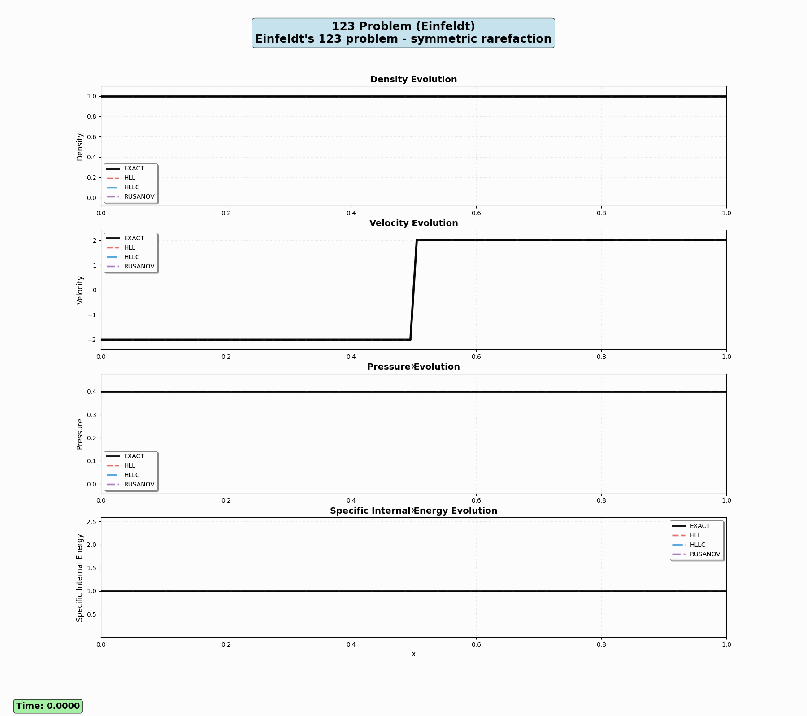

- **États initiaux (Collision Two Shocks)** : \[ \\text{Gauche : } (\\rho_L, u_L, p_L) = (1.0, 1.0, 1.0), \\quad \\text{Droite : } (\\rho_R, u_R, p_R) = (1.0, -1.0, 1.0) \]
- **États initiaux (Einfeldt Strong Rarefaction)** : \[ \\text{Gauche : } (\\rho_L, u_L, p_L) = (1.0, -1.0, 10^{-5}), \\quad \\text{Droite : } (\\rho_R, u_R, p_R) = (1.0, 1.0, 10^{-5}) \]
- **États initiaux (Einfeldt 123)** : \[ \\text{Gauche : } (\\rho_L, u_L, p_L) = (1.0, -2.0, 0.4), \\quad \\text{Droite : } (\\rho_R, u_R, p_R) = (1.0, 2.0, 0.4) \]
- **États initiaux (Blast Wave)** : \[ \\text{Gauche : } (\\rho_L, u_L, p_L) = (1.0, 0.0, 1000.0), \\quad \\text{Droite : } (\\rho_R, u_R, p_R) = (1.0, 0.0, 0.01) \]
- **Test** : Chocs multiples, rarefactions fortes.
- **Rusanov** : Stable mais très diffusif, détails perdus.
- **HLL** : Capture mieux les chocs, limite sur rarefactions.
- **HLLC** : Précis sur chocs et rarefactions, bon compromis.
- **Roe** : Très précis, mais instable sur rarefactions extrêmes.

## Synthèse

- **Rusanov** : Simple, stable, mais trop diffusif.
- **HLL** : Robuste, mieux sur chocs, faible sur contacts.
- **HLLC** : Meilleur équilibre, précis sur contacts et chocs.
- **Roe** : Très précis, mais nécessite corrections pour stabilité.